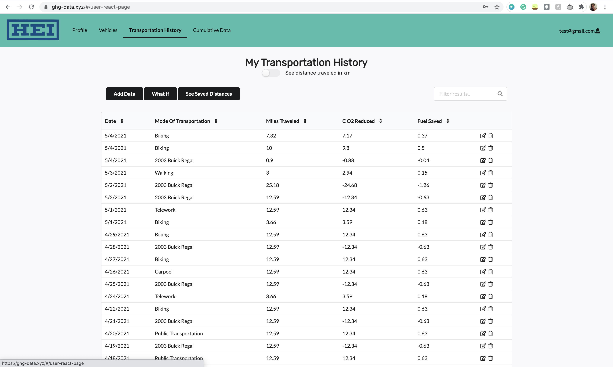
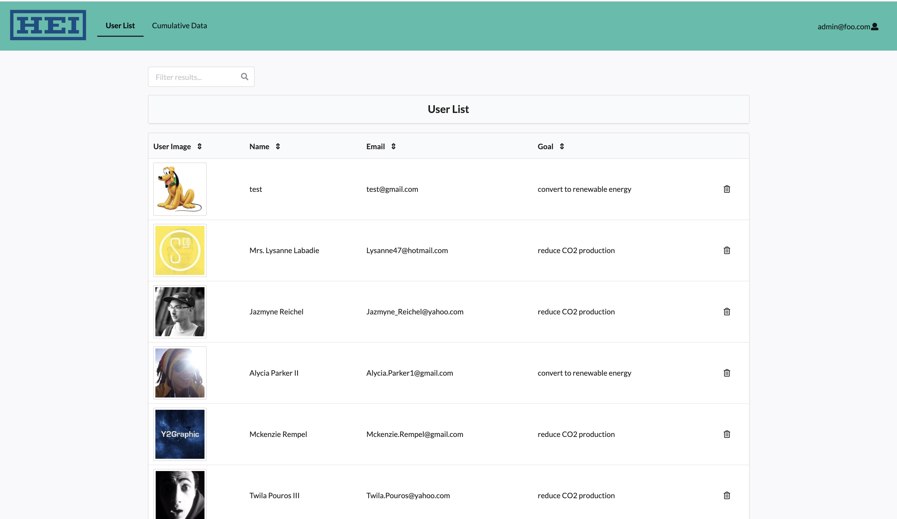

---

layout: essay

type: essay

title: (Virtually) Developing Software into the 20s

date: 2021-05-10

labels:

- Software Engineering

- Learning

- ESLint

- Javascript

---
## Quote of the Experience 
If you are new to reading my work, I always start my work with a quote that describes my experience.
I have many favorite quotes that motivate me to do better. Throughout my fourth year at University of Hawai'i and enduring my first Software Engineering class, I have been posting quotes that I have collected over time so I will continue that through my second Software Engineering class. Here it goes:

My mom was right, when you find what you love, you'll know.

## What Do You Know About Software Engineering?
Personally I believe Software Engineering is amazing in different aspects. Its a way to express yourself and a form of art. It is a chance to do something that not a lot of people can do-- code as an art. Of course when someone heres "Software Engineering,"  it immediately sounds intimidating. However, Software Engineering is more than a bunch of lines of code, deadlines and group meetings. I see it as a form of hope for myself and others. 
Now, if you really do not know what Software Engineering is. You can easily google "What is software engineering?" and this will appear:
"Software engineers are computer science professionals who use knowledge of engineering principles and programming languages to build software products"

Which sums it up for the most part, but let me explain to you how I have been using it in my ICS 414 Software Engineering course. My definition of Software Engineering is a bit different because my team and I just developed a new app while living in a pandemic. We have all had to learn new languages, new communication styles and many more ways to be successful in our class. We used the following key to piece together apps in our class:

Functional Programming: Underscore
Github
Meteor API
IntelliJ IDE
MongoDB
TestCafe
Coding Standards: ESLint
Agile Project Management: Issue Driven Project Management

These tools we used are so important when developing projects. I personally wouldn't have had made successful applications without them. Since January of 2021 til the beginning of May, I worked with eight others on an app we made for Hawaiian Electric that tracks Green House Gas Emissions for users in Hawaii. I had a smooth experience with my team while making out app. I have noticed that the more times I work on an app, I fall more in love with Software Engineering. Which is what I mean when I say my mom is right.. I know that I love Software Engineering!

## Learn More About Our application 
Please visit our project page here to learn more about our project:
This link is to the official deployment of the app: 
[GHG-Tracker Web App](https://ghg-data.xyz/#/)

This link includes directions to running our program locally.
[GHG-Tracker](https://hot-n-code.github.io/)

The source code is in our GitHub repository located here:
[GHG-Tracker GitHub Repository](https://github.com/hot-n-code/ghg-tracker)

## The First Look
I strongly believe that during the pandemic we are still adapting to new ways to learn while online. Using discord was the key to our communication. We met 2-3 times a week to discuss our project. When we first started our project this semester it was slow, but productive. In the beginning, I saw it as a test of who wanted to be a leader within the group. I found that another teammate and I led many of the group discussion and initiating the next stop in the project.
In the first couple of weeks we focused on the mockups and creating the UI of the project. As we moved along the calendar the deeper we dove into the project. When managing a big project using Issue Driven Project Management is the most effective way to hit milestones. Without it then it lacks structure and accountability.

For the UI, we designed it to be vibrant and engaging.
Here is an example of our UI: 

## The Deep Talks
As we dove deeper into the project, the backend portion of the app came in hot and fast. This is where I lacked knowledge and struggled the most. Understanding the collections and how react, meteor and mongo worked together was mind boggling. I developed the react tables that used the collections. The most difficult part of this was understanding how to connect the functions to the table. The "npm react table" also had some flaws so we had to connect with the developer to fix issues we ran into. 

The Transportation History of the users traveling:

The Administrations list of users:

## My Proud Moment.. Graphics!
In the beginning of the project we presented our app to the client. He was thoroughly impress with our graphics. I designed majority of the graphics in the app. My thought process while making the graphics was to use fun graphics. I wanted the user interaction with the app to be joyful. I also wanted the graphics to be relevant to the topic of green house gas emissions.

This cloud was our most complimented graphic, but let me tell you it was the most difficult to get the number to stay in one place..

I struggled with the CSS to have it stay in one place when screen sizes changed and when the number got bigger. I had to get help from another teammate and we were able to figure it out.

## The End
The bigger picture of this app is the ability to work as a team. My favorite part of taking this course was my group was able to work to their strengths. We were all disciplined and executed timely. Also, not a single teammate tried to control the whole project in comparison to other projects I have had to work on. This semester has been very educational and great experience. I love classes like this because it gives us a taste of the work that we will have in the workforce. I also liked that we were able to develop a well functioning app without meeting in person. As titled, this is what it is like to be coding in the 20s.
