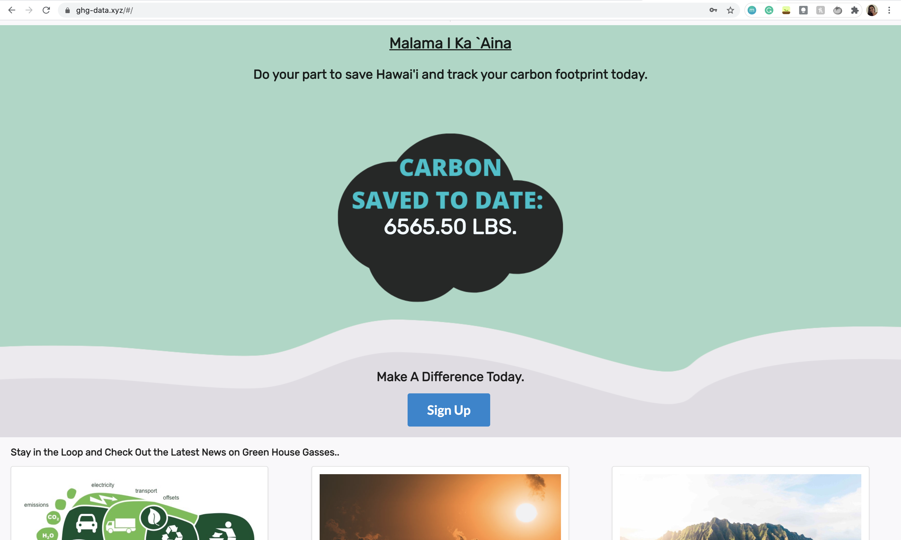
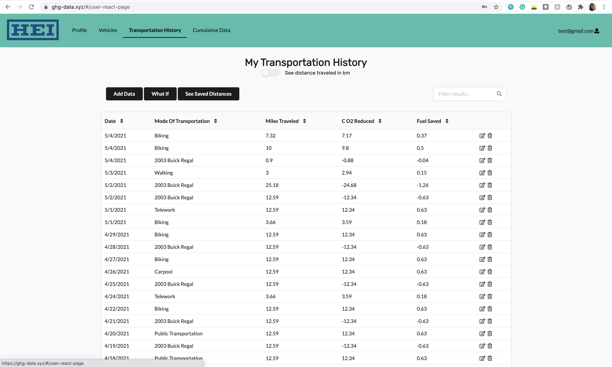
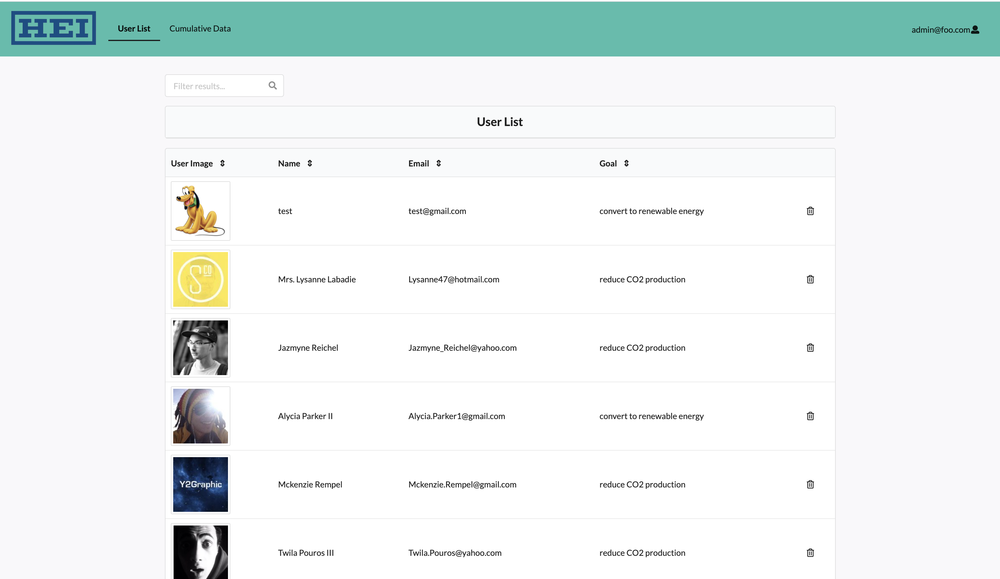
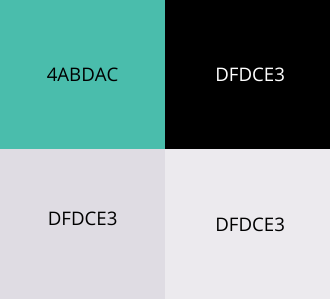
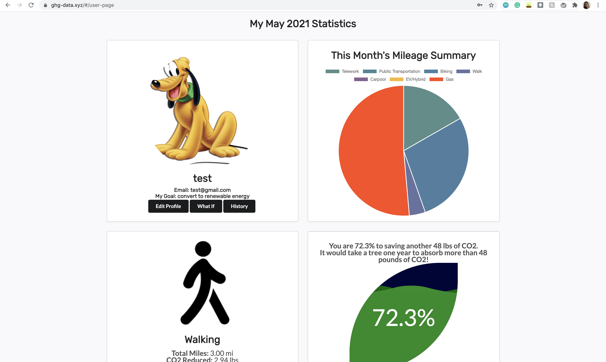
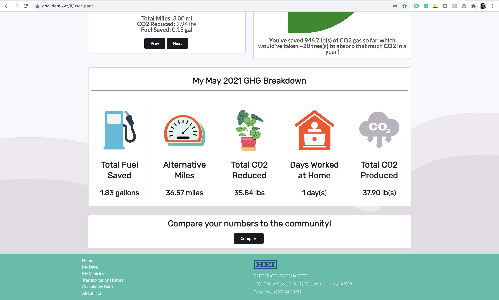
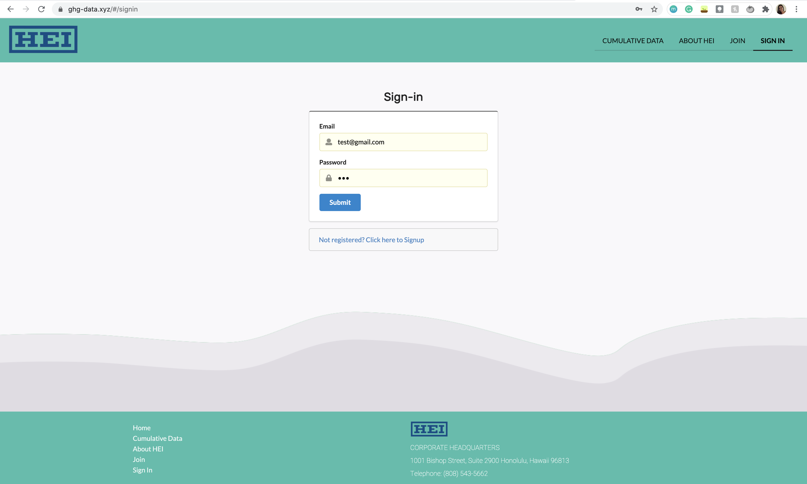
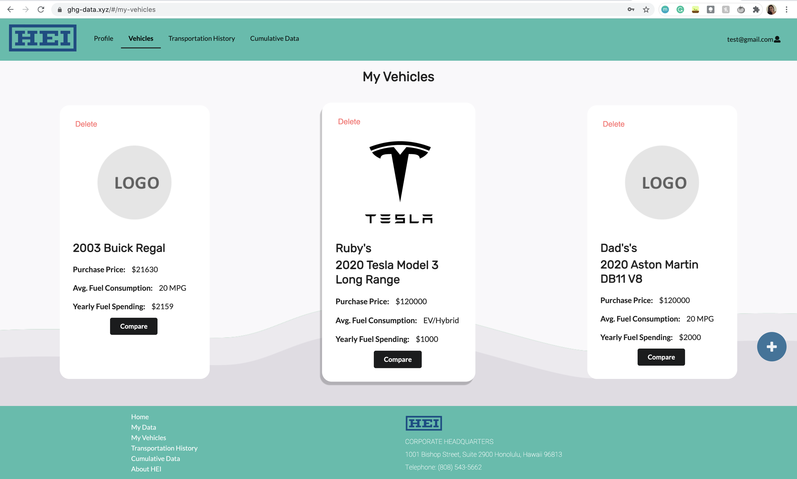

## Overview of GHG-Tracker Application
GHG-Tracker is an application targeted for Hawai'i residents and people who want to reduce their carbon footprint. I worked on this project with Daphne Tapia, Sophia Cruz, Timothy Huo, Jackei Wong, Michael Gainey, Yiwen Chen, Chak Hon Lam, and Khyla Rabang. We created this app for Hawaiian Electric Industry (HEI) where they asked us to make a user friendly app to track carbon emissions. This targets users who want to set a goal and reduce their carbon footprint. As climate change is rising, we hope this app will reduce carbon emissions. 

## Learn More About Our application 
Please visit our project page here to learn more about our project:
This link includes directions to running our program locally.
[GHG-Tracker](https://hot-n-code.github.io/)

The source code is in our GitHub repository located here:
[GHG-Tracker GitHub Repository](https://github.com/hot-n-code/ghg-tracker)

## My Contribution to the Project 
I contributed to the complete Front End development of this application with Michael Gainey and I worked on the backend development of the tables to hold the data. I also designed graphics for the application.

## My Pages
I worked on many pages along with the front end.
I created the Landing Page:

I implemented a npm React Table for the the data between users and administration.
The Transportation History of the users traveling:

The Administrations list of users:

## Front End, Visuals, UI
In the beginning, Michael and I chose a theme and a color pallete. We decided on the following four colors. We wanted to use minimalistic tones like white and grey, but add in pop to keep the app alive.

One goal of mine was to use interactive, bright visuals. The graphics that are used on the site were all designed by me. The goal of having more color is to make the user feel they are a part of a happy app when using it.
The graphics stand out on the Users Data page seen here:

As a team we all decided to use a wave as a consistent graphic background in the app.

As you can see, the graphics are interactive and fun. 

I helped with other things when my teammates were working and needed help. We used Issue Driven Project Managemet and each of us stuck with a specific aspect of the project in order to finish it efficiently. We had a consistent number of issues for each teammate to finish the app on time.

## Reflection
This project was my best experience in group projects. My group was very knowledgeable, hardworking, patient and most importantly, great communicators. I had a fun, but challenging time. My personal growth came when I had to think methodically when choosing the theme and how to create something attractive. I also have barely worked on the back end development in a project so it was interesting when working with the collections and methods. Overall, I am very pleased with my performance and my groups. 

