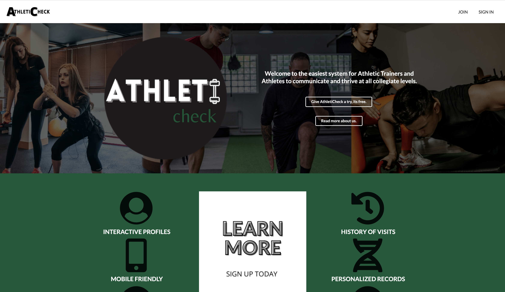
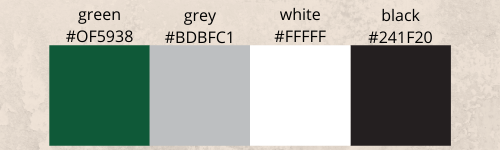
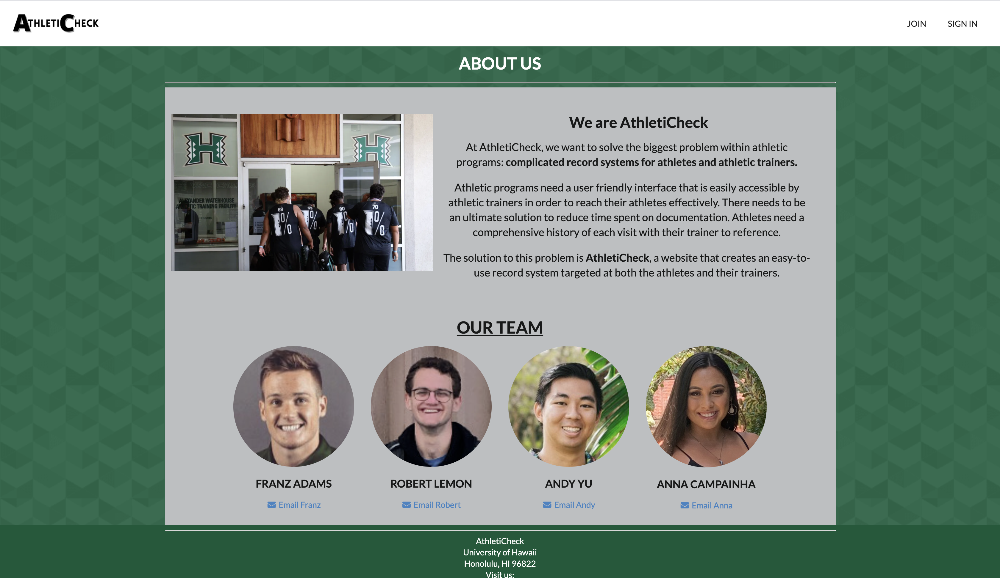

## Overview of GHG-Tracker Application
GHG-Tracker is an application targeted for Hawai'i residents and people who want to reduce their carbon footprint. I worked on this project with Daphne Tapia, Sophia Cruz, Timothy Huo, Jackei Wong, Michael Gainey, Yiwen Chen, Chak Hon Lam, and Khyla Rabang. We created this app for Hawaiian Electric Industry (HEI) where they asked us to make a user friendly app to track carbon emissions. This targets users who want to set a goal and reduce their carbon footprint. As climate change is rising, we hope this app will reduce carbon emissions. 

## Learn More About Our application 
Please visit our project page here to learn more about our project:
This link includes directions to running our program locally.
[GHG-Tracker](https://hot-n-code.github.io/)

The source code is in our GitHub repository located here:
[GHG-Tracker GitHub Repository](https://github.com/hot-n-code/ghg-tracker)

## My Contribution to the Project 
I contributed to the complete Front End development of this application. I created the theme to match throughout the entire application, I made sure everything the user did was easily used and attractive to their eye. 

I also created the logos for the application.

I also helped with anything outside of the front end development if my team needed it. We used Issue Driven Project Managemet and each of us stuck with a specific aspect of the project in order to finish it efficiently. I worked on the entire front end development the entire time in order to minimize the complications we could have faced.

## Reflection
This project was challenging but my group made it manageable. As a group, we all had a great work ethic so we finished everything on time. Since we are doing distance learning, our entire porject was based off communicating on Discord. This required a lot of patience and consistency. The project revealed how important it is to have deadlines and goals for each milestone or else things will not be finished. Without having the issues, we would have probably procrastinated. I also learned that Software Engineering is really frusrating and it takes time to develop something. Oour application is great but I do believe there is room for improvement.

