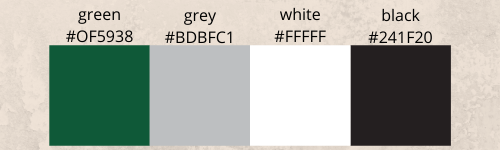
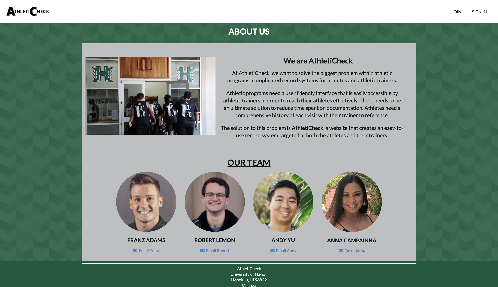
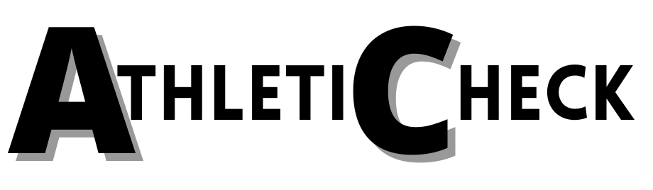
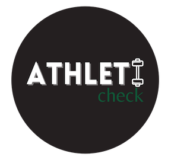

## Overview of AthletiCheck Application
AthletiCheck is an application targeted for collegiate Athletic Trainers and Athletes. I worked on this project with Franz Adam, Robert Lemon and Andy Yu. There are currently limited resources for Athletic Trainers to record their work done with Athletes in the training room. A lot of the time they are writing down the work done then having to manually enter it into a computer. AthletiCheck allows AT's to have a list of their Athletes and can easily manage them while also communicating with them and their treatment needs.

## My Contribution to the Project 
I contributed to the complete Front End development of this application. I created the theme to match throughout the entire application, I made sure everything the user did was easily used and attractive to their eye. 

I also created the logos for the application.

I also helped with anything outside of the front end development if my team needed it. We used Issue Driven Project Managemet and each of us stuck with a specific aspect of the project in order to finish it efficiently. I worked on the entire front end development the entire time in order to minimize the complications we could have faced.

## Reflection
This project was challenging but my group made it manageable. As a group, we all had a great work ethic so we finished everything on time. Since we are doing distance learning, our entire porject was based off communicating on Discord. This required a lot of patience and consistency. The project revealed how important it is to have deadlines and goals for each milestone or else things will not be finished. Without having the issues, we would have probably procrastinated. I also learned that Software Engineering is really frusrating and it takes time to develop something. Oour application is great but I do believe there is room for improvement.

## Learn more
Please visit our project page here to learn more about our project. 
[AthletiCheck](https://athleticheck.github.io/)
