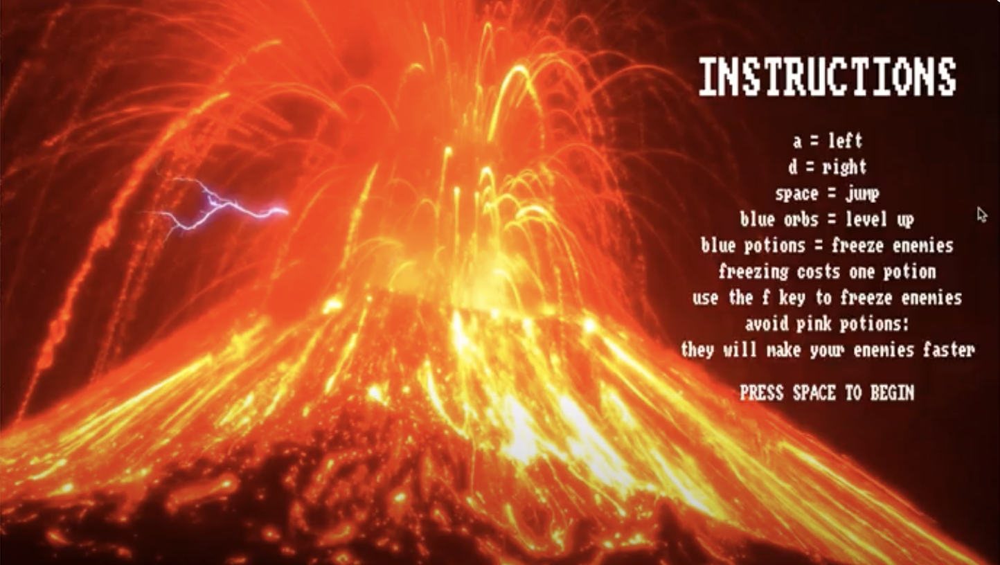

  

Vesuvius was my third project in my undergraduate career. The objective of the game is the main player, the Goddess, is trying to escape the lava where lava blobs slowly kill the player. The player can collect potions to redeem themself. 

This was my first group project and I learned that it takes time to create a detailed game. I worked with two other classmates Sophia Rathyen and Kacie Kimoto. I wrote the main function while my team wrote the functions. Writing this program taught me that its a lot of work to put together a game. Also, working in a group taught me the importance of communication and having a team when developing programs. Collaborating together required a lot of negotiation and patience which is am important attribute to our careers.

You can watch a demonstration of Vesuvius on [Youtube](https://youtu.be/UZcx7qcs3dQ)
